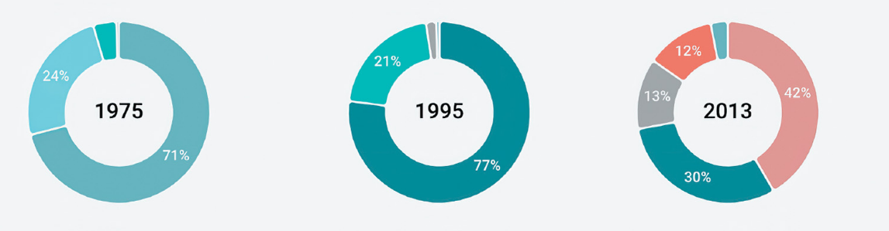

# Assignment 2

> Please open this markdown in VSCode with GitHub Markdown Preview to render all the HTML. And use light theme.   

Full name (Student ID Number)

You can answer in English or Bahasa Indonesia. If you insert some images
to your markdown file, please use relative path and submit your work 
in a compressed file `.zip`.

You may use ChatGPT, but be careful that it may give you a false answer 
and sometimes it is hallucinated. The point of learning is to understand what you write. 
Without understanding your answer by yourself, this assignment is **useless**.

## Problem 1 (70 points)
Using the data [`music-industry-sales.csv`](./datasets/music-industry-sales.csv), 
recreate the following three pie charts.
Find out the correct dimension for all elements and 
if you notice the distance between those three pie charts
are uneven.

All the color codes are
<b>vinyl</b> , 
<b>8-track</b> , 
<b>cassette</b> , 
<b>cd</b> , 
<b>download</b> ,   
<b>streaming services</b> , and
<b>other</b> , 

## Problem 2 (30 points)

With a bit of creativity, make a "good" visualization using only pie chart
for all years in the `music-industry-sales.csv` data. The meaning of "good"
in here is that your visualization is readable and comprehensive enough
to capture the meaning the data and can contribute an insight to the decision
maker who is working in the music industry.