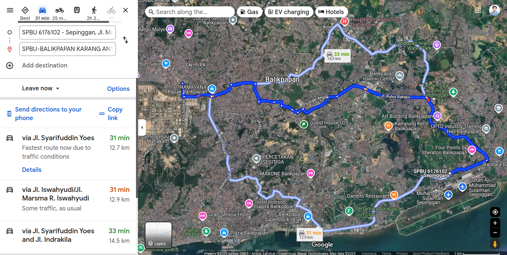
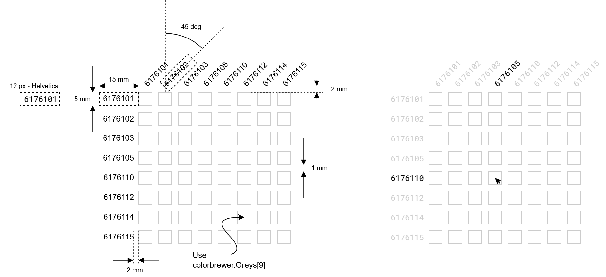
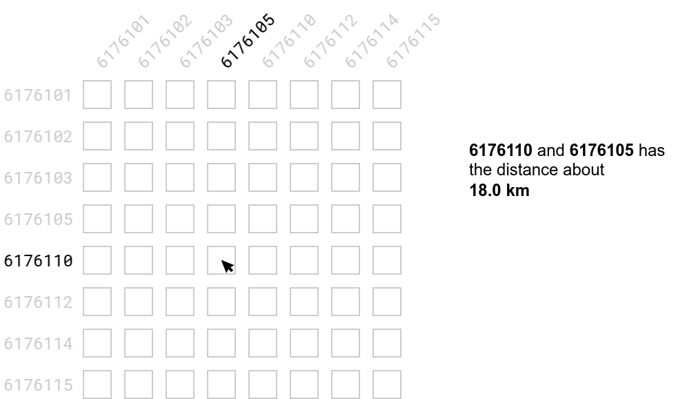

# Assignment 3

<table>
  <tr>
    <td style="text-align:right"> Given data :
    <td> May 1st, 2025
  <tr>
    <td style="text-align:right"> Due date :
    <td> May 12th, 2025, 23:59 WITA
</table>

> Please open this markdown in VSCode with GitHub Markdown Preview to render all the HTML, and use light theme.   

Full name (Student ID Number)

You can answer in English or Bahasa Indonesia. If you insert some images
to your markdown file, please use relative path and submit your work 
in a compressed file `.zip`.

You may use ChatGPT, but be careful that it may give you a false answer 
and sometimes it is hallucinated. The point of learning is to understand what you write. 
Without understanding your answer by yourself, this assignment is **useless**.

## Problem 1 (70 points)

In this assignment, you need to collect by yourself the distance data between
all gas stations in Balikpapan. All the active and available gas stations in
Balikpapan are listed in [here](https://mypertamina.id/spbu).

Store the data into `2025-balikpapan-gas-stations.json` with the following template

```json
{
  "nodes": [
    {"name":"SPBU 6176101"},
    {"name":"SPBU 6176102"},
    {"name":"SPBU 6176103"},
    {"name":"SPBU 6176105"},
    {"name":"SPBU 6176110"},
    {"name":"SPBU 6176112"},
    {"name":"SPBU 6176114"},
    {"name":"SPBU 6176115"},
  ],
  "links": [
    {"source": 0, "target": 1, "value": 12700},
    ... // (there are 64 pairs and the value is the distance)
  ]
}
```

To get the distance between any two gas stations, you need to use Google Maps, 
and then record all the distance between any two gas stations in Balikpapan.
Here is the example, the distance between gas station No. 6176101 and 
No. 6176102. You have to record the shortest distance as accurate as possible.



**Note**, the distance between two gas stations A and B sometimes is 
not reflexive, $\text{dist}(A, B) \neq \text{dist}(B, A)$.

After you have collected data in `.json` file, now you have to 
create an adjacency matrix with the following detailed of
dimension and size



In the left image, we have the dimension for 

- the label (widht and height), 
- font size, 
- font family, 
- the bounding box of the label, 
- x-axis label rotation,
- the distance between label and grid box
- color ramp for each grid box (use `colorbrewer.Greys[9]`)
- the gap size between each grid box (horizonta and vertical)

In the right image, we have the behaviour of adjacency matrix, 
when we hover the mouse. It should change the font color of
non-selected labels.


## Problem 2 (20 points + 10 points)

**+ 20 points**  
Add additional sidebar menu, to show how far is the distance and
the address of two selected gas stations. 
Here is the design




**+ 10 points**: improve the design.
