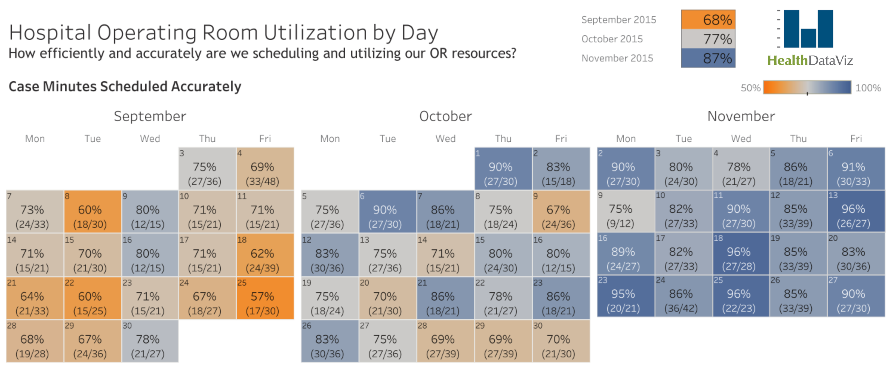

# Assignment 3

<table>
  <tr>
    <td style="text-align:right"> Given data :
    <td> May 21st, 2025
  <tr>
    <td style="text-align:right"> Due date :
    <td> May 26th, 2025, 23:59 WITA
</table>

> Please open this markdown in VSCode with GitHub Markdown Preview to render all the HTML, and use light theme.   

Full name (Student ID Number)

You can answer in English or Bahasa Indonesia. If you insert some images
to your markdown file, please use relative path and submit your work 
in a compressed file `.zip`.

You may use ChatGPT, but be careful that it may give you a false answer 
and sometimes it is hallucinated. The point of learning is to understand what you write. 
Without understanding your answer by yourself, this assignment is **useless**.

## Problem 1 (70 points)
In this assignment, you have a task to break down all the components
of the following dashboard



First, you need to create the data manually from the given image.
There are three months that have been shown in the dashboard.
Store all the numbers into `room-utilization.json`

You can use the following format
```csv
Date,accurate_case,total_case
2015-Sep-3,27,36
2015-Sep-4,33,48
2015-Sep-7,24,33
...
2015-Nov-27,27,30
```

Two numbers inside the parenthesis are the accurate cases and 
total cases. The percentage in each date is calculated by
the ratio of accurate cases and total cases.
You can search for the logo of HealthDataViz from Google and
put it on the top right.

Determine the color space. The domain is started from the 
percentage 50% up to 100%.

To solve this problem, you can use either with D3.js or
with React framework.

Build that dashboard as close to the original as possible.


## Problem 2 (30 points)

Visit the following updated version of the dashboard above
in [tableau public](https://public.tableau.com/app/profile/healthdataviz/viz/HealthDataViz-HospitalORUtilization_16135821834160/ORUtilizationCalendarDetails). Add some data selector, 
using drop-down list, to select between data in (2015-Sep, 2015-Oct, 
2015-Nov) and (2021-Jan, 2021-Feb, 2021-Mar). In 2021 dataset,
the total cases are not given directly, but you need to explore
each date, and sum all the cases.