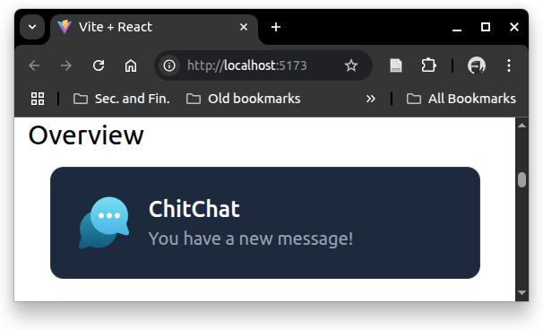

# React + Vite (+ Tailwind CSS)

This template provides a minimal setup to get React working in Vite with 
HMR and some ESLint rules. You can download this base template from
[Vite documentation](https://vite.dev/guide/#trying-vite-online).
In "Trying Vite Online", select "Javascript" column and "react" row. It
will bring you to StackBlitz website. In the project directory, click
"Download Project" (cloud with down arrow icon), to get this base template.

## Preparation
Use Node.js version 22.14.0, and install all the modules by running `npm install` in the directory `react-vite-tailwindcss-review`

We use Tailwind CSS v4.1 and the installation follow from
["Get Started with Tailwind CSS: Using Vite"](https://tailwindcss.com/docs/installation/using-vite)

### Install Tailwind CSS
Install `tailwindcss` and `@tailwindcss/vite` via npm.
```
npm install tailwindcss @tailwindcss/vite
```
 
### Configure the Vite plugin
Add the `@tailwindcss/vite` plugin to your Vite configuration.   
**vite.config.js**
```js
import { defineConfig } from 'vite';
import tailwindcss from '@tailwindcss/vite';

export default defineConfig({
  plugins: [
    tailwindcss(),
  ],
})
```

### Import Tailwind CSS
Add an `@import` to your CSS file that imports Tailwind CSS.    
**./src/index.css** 
```css
@import "tailwindcss";
```


### Start your buiild process
Run your build process with `npm run dev` or whatever command is configured in your `package.json` file.
```
npm run dev
```

### Start using Tailwind in your HTML
Because we use template project for Vite, we can start editing from `App.jsx`.
Replace the content of `App.jsx` with
```jsx
const App = () => {
  return (
    <>
      <h1 class="my-3 mx-3 text-3xl font-bold underline">
        Hello World React + Vite + Tailwind CSS</h1>
    </>
  )
}

export default App;
```

If you follow the procedure correctly, you will get


## Understanding core concepts

Overview



Responsive   


Hover state   


Flexbox responsive   


Dark mode   


Managing duplication    
